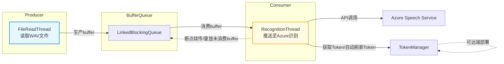
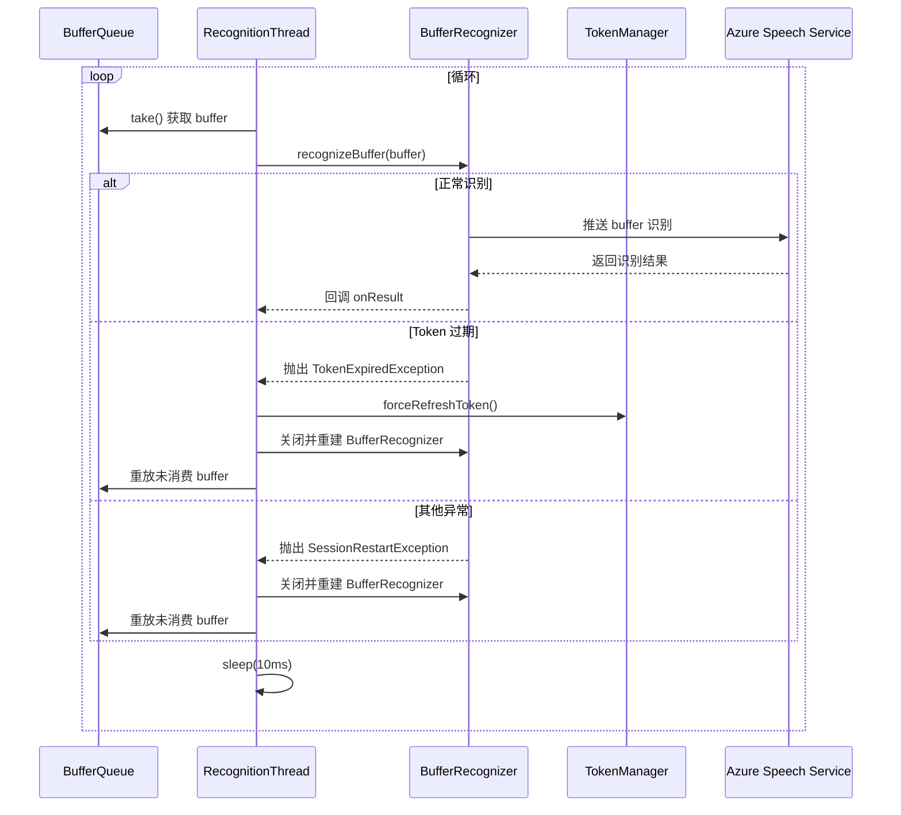

# SpeechToTextAudioContinuousRecognition

## 项目简介 / Project Introduction

本项目旨在通过使用一个 wav 文件模拟无限长的音频输入流，不断读取音频 buffer 并实时送入 Azure Speech Service 进行流式语音识别。项目特别封装了 token 获取机制，客户端无需保存 subscription key，只需通过 Token Manager 获取临时 token 即可。Token Manager 可独立部署在远端后台服务，实现客户端与密钥的解耦，提升安全性。适用于需要将长音频内容自动转录为文本的场景，如会议记录、采访整理等。

This project simulates an infinite audio input stream using a wav file, continuously reading audio buffers and streaming them to Azure Speech Service for real-time recognition. It features a decoupled token acquisition mechanism: the client does not need to store the subscription key, but obtains temporary tokens via a Token Manager, which can be deployed as a remote backend service. This design enhances security and decouples the client from sensitive credentials, making it suitable for long audio transcription scenarios.

---

## 主要功能 / Features

- 使用 wav 文件模拟无限音频流，通过不断读取 buffer 实现流式语音识别
- 支持本地音频文件（如 FLV、WAV）提取与转码
- 集成 Azure 语音识别，支持连续语音转文本
- 封装 Token 获取机制，客户端与 subscription key 解耦
- 支持将 Token Manager 独立部署于远端后台服务
- 配置灵活，便于二次开发和集成

---

## 技术架构 / Technical Architecture

本项目核心采用“双线程+队列”架构实现高效流式识别：

- **FileReadThread**：持续读取 wav 文件内容，按 buffer 切片后写入 `LinkedBlockingQueue`，模拟无限音频流。
- **RecognitionThread**：不断从队列中取出 buffer，推送到 Azure Speech Service 进行实时识别。支持异常自动重启和 buffer 重放，保证识别不中断。
- **LinkedBlockingQueue**：作为线程间缓冲区，解耦读写速率，防止 OOM。
- **TokenManager**：负责获取和刷新 Azure 访问 token，支持远端部署，提升安全性。

### 架构图



**说明：**
- FileReadThread（生产者）不断读取音频并生产 buffer，RecognitionThread（消费者）不断消费 buffer 并推送识别，二者通过队列解耦，典型生产者-消费者模式。
- RecognitionThread 支持 token 过期自动刷新（与 TokenManager 交互），以及异常/重启时断点续传（重放未消费 buffer），保证识别不中断。
- TokenManager 推荐远端部署，客户端仅通过 HTTPS 获取 token。

---

### RecognitionThread 时序图 / Sequence Diagram

RecognitionThread 主要流程如下：



**说明：**
- RecognitionThread 持续从队列获取 buffer 并推送识别。
- 遇到 token 过期或异常时，自动刷新 token、重建识别器并重放未消费 buffer，保证流畅不中断。

## 环境依赖 / Requirements

- Android Studio (建议使用最新稳定版)
- JDK 8 及以上
- Gradle
- 有效的 Azure Speech Service 订阅（需获取 subscriptionKey 和 region）

---

## 快速开始 / Getting Started

1. **克隆项目 / Clone the repository**
   ```bash
   git clone <your-repo-url>
   ```

2. **在 Azure 门户获取语音服务密钥和区域 / Get your Azure Speech Service subscription key and region**

3. **配置密钥 / Configure your key**

   编辑 `app/src/main/assets/config.json`，填入你的 Azure 订阅信息：

   ```json
   {
     "subscriptionKey": "YOUR_AZURE_SPEECH_KEY",
     "region": "YOUR_AZURE_REGION"
   }
   ```

4. **准备音频文件 / Prepare Audio File**

   在启动识别前，请将项目目录下的 `output.wav` 拷贝到设备的指定路径（AUDIO_PATH）：

   - 目标路径：`/sdcard/Android/data/com.yourcompany.speechtotext/files/output.wav`
   - 推荐使用 adb 命令：

     ```bash
     adb push output.wav /sdcard/Android/data/com.yourcompany.speechtotext/files/output.wav
     ```

   确保该路径下存在 output.wav，否则识别无法正常启动。

5. **构建与运行 / Build and Run**

   - 使用 Android Studio 打开项目，点击运行即可安装到设备或模拟器。
   - 或者命令行构建：
     ```bash
     ./gradlew assembleDebug
     ```

---

## 主要文件结构 / Main File Structure

```
SpeechToTextAudioContinuousRecognition/
├── app/
│   ├── src/
│   │   ├── main/
│   │   │   ├── assets/
│   │   │   │   └── config.json         # Azure 配置
│   │   │   ├── java/com/yourcompany/speechtotext/
│   │   │   │   ├── MainActivity.java   # 主入口
│   │   │   │   ├── AzureSpeechRecognizer.java / .kt # 语音识别核心
│   │   │   │   ├── AzureTokenManager.java / .kt     # Token 管理
│   │   │   │   ├── BufferRecognitionManager.java    # 缓冲识别
│   │   │   │   ├── AudioExtractorUtil.java / .kt    # 音频提取工具
│   │   │   │   └── ConfigManager.java / .kt         # 配置管理
│   │   │   ├── res/
│   │   │   │   ├── layout/activity_main.xml         # 主界面布局
│   │   │   │   └── mipmap-anydpi-v26/               # 启动图标
│   │   │   └── AndroidManifest.xml                  # 应用清单
│   ├── build.gradle
├── build.gradle
├── settings.gradle
└── README.md
```

---

## 配置说明 / Configuration

- `app/src/main/assets/config.json`  
  - `subscriptionKey`：你的 Azure 语音服务订阅密钥（仅开发/测试用，生产环境建议留空）
  - `region`：Azure 区域（如 southeastasia、eastus 等）
  - `tokenEndpoint`：Token Manager 服务地址（推荐生产环境仅配置此项，客户端通过该地址获取 token，无需保存 subscription key）

> 推荐生产环境仅配置 `tokenEndpoint`，由远端 Token Manager 统一管理密钥，客户端通过 HTTPS 获取 token，提升安全性。

---

## 致谢 / Acknowledgements

- [Microsoft Azure Speech Service](https://azure.microsoft.com/en-us/products/ai-services/speech-to-text/)
- Android 开发社区

---

## License

MIT License. See [LICENSE](LICENSE) for details.
